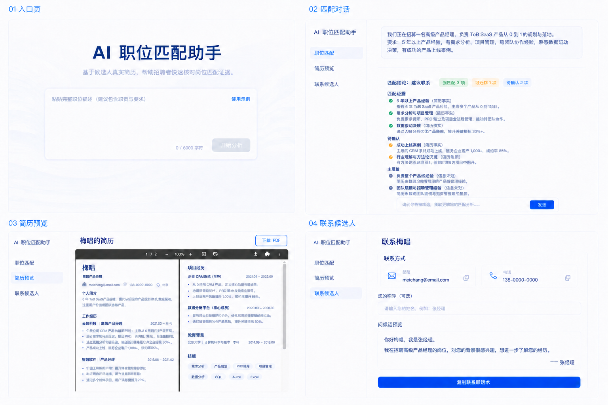
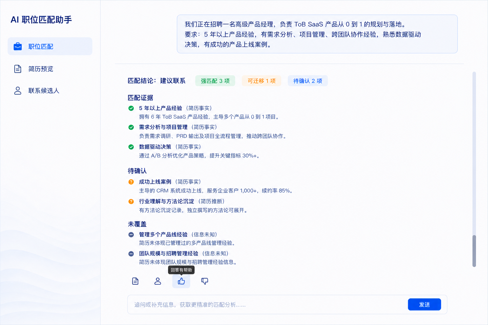

# Frontend Technical Design

## Document Information


| Field             | Description                                                                            |
| ----------------- | -------------------------------------------------------------------------------------- |
| Document Name     | AI Job Fit Assistant Frontend Technical Design                                         |
| Document Type     | Frontend Technical Design                                                              |
| Version           | v0.9                                                                                   |
| Status            | Finalized                                                                              |
| Last Updated      | 2026-08-27                                                                             |
| Related Documents | Product Requirement Document, Lightweight AI Design Decision, Backend Technical Design |


## Version Log

| Version | Date | Change | Reason |
| --- | --- | --- | --- |
| v0.9 | 2026-08-27 | Distinguished permanent tracking rejections from retryable delivery failures in the bounded browser queue. | Prevent one invalid event from blocking later valid analytics events while retaining transient failures for retry. |
| v0.8 | 2026-08-27 | Defined centralized delivery, privacy-safe event payloads, pseudonymous session identity, and a bounded retry queue for all six S001 tracking events. | Ensure frontend tracking supports aggregate, cross-session MVP metric evaluation without blocking the recruiter journey. |
| v0.7 | 2026-08-26 | Required a meaningful feedback contribution after a recruiter selects Helpful or Not Helpful, added rating-specific predefined reasons, and required visible hover/focus labels for contextual icon actions. | Reduce empty feedback submissions and make compact icon actions easier to understand without changing the feedback API or the PRD's voluntary initiation rule. |
| v0.6 | 2026-08-26 | Approved the supplied desktop reference UI: standalone entrance, three-item workspace navigation, scrollable matching conversation with bottom input and contextual actions, PDF preview, and contact-copy layout. | Convert the reviewed visual direction into implementation requirements while preserving the existing MVP scope and API contracts. |
| v0.5 | 2026-08-25 | Added the approved entrance page and persistent left-navigation workspace with mutually exclusive conversation, résumé, and contact views. | Align the finalized frontend behavior with the reviewed UI demonstration before implementation. |
| v0.4 | 2026-08-25 | Finalized the frontend design and selected React, TypeScript, and Vite. | Establish the frontend implementation baseline before planning. |


## 1. Frontend Design Goal

### 1.1 Frontend Responsibility

The frontend is responsible for providing the recruiter-facing experience of AI Job Fit Assistant.

The frontend should:

- Provide interfaces for recruiters to input job descriptions;
- Present AI-generated matching analysis results;
- Allow recruiters to view or download the candidate's resume independently;
- Support follow-up question interactions;
- Provide feedback, candidate contact, and owner contact entry points;
- Present clear interaction states during system processing.

The frontend should not:

- Implement AI reasoning logic;
- Determine candidate-job matching results;
- Interpret or modify AI-generated conclusions;
- Implement backend business logic.

The frontend focuses on presenting product information and backend-provided results while enabling recruiter interactions.

### 1.2 Design Principles


#### Clear AI Content Presentation

The frontend should help recruiters understand AI-generated content by:

- Presenting matching analysis clearly;
- Making important information easy to review;
- Separating AI-generated content from user actions.

The frontend should display AI outputs without adding unsupported interpretations.

#### Localization Compatibility

The frontend implementation should remain compatible with future multilingual support.

Requirements:

- Avoid hard-coded user-facing text inside components;
- Keep language configuration separable;
- Avoid architecture decisions that block future localization.

The MVP supports only one language and does not require a complete internationalization system.

#### UI Design Principles

The UI should:

- Prioritize readability of AI analysis;
- Make important actions easy to find;
- Avoid overwhelming recruiters with excessive information;
- Maintain a clear assistant-like interaction experience.


#### Flexible MVP Implementation

The design should provide enough guidance while allowing UI iteration during development.

The document should define:

- User experience;
- Frontend responsibilities;
- Information requirements;
- The approved desktop visual hierarchy and placement of primary controls.

The document should not restrict:

- Detailed spacing and visual styling;
- Responsive navigation presentation on smaller screens;
- Specific component implementation;
- Routing or local-state implementation details.


## 2. Page Structure


### 2.1 Job Assistant Workspace Structure

The frontend is designed around a standalone Entrance View followed by a Job Assistant Workspace.

The Entrance View uses the full available desktop canvas and does not display the workspace navigation. After a valid job description is submitted, the desktop workspace uses persistent navigation on the left and one active view on the right. The right side displays only one of the following views at a time: conversation, resume preview, or contact.

```text
Entrance View
├── Product Introduction
└── Job Description Input

Job Assistant Workspace
├── Persistent Left Navigation
│   ├── Product Brand / Home Control
│   ├── Job Matching
│   ├── Resume Preview
│   └── Contact Candidate
│
└── Right Workspace — one active view at a time
    ├── Conversation View
    │   ├── Submitted Job Description
    │   ├── Scrollable AI Output
    │   │   ├── Matching Analysis
    │   │   └── Follow-up Answers
    │   ├── Contextual Actions
    │   │   ├── View Resume
    │   │   ├── Contact Candidate
    │   │   └── Helpful / Not Helpful Feedback
    │   └── Bottom Follow-up Input
    │
    ├── Resume Preview View
    │   ├── Original Resume Preview
    │   └── Resume Download
    │
    └── Contact View
        ├── Candidate Contact Information and Copy Controls
        ├── Optional Recruiter Name
        └── Greeting Preview and Copy Action
```

Submitting a valid job description opens the Conversation View. Selecting Resume Preview or Contact Candidate replaces the current right-side content. These views must not be stacked below the conversation or shown beside it. Returning to Job Matching should not intentionally clear the current conversation. Selecting the product brand returns to the Entrance View and must not silently discard an active conversation.

### 2.2 Core Components


#### Entrance View

Responsible for introducing the product and starting the matching journey.

It includes:

- A brief explanation of the product and fixed-candidate scope;
- Job description input;
- A clear action to begin analysis.

Submitting a valid job description transitions the right workspace to the Conversation View.

#### Conversation View

Responsible for supporting the main AI assistant interaction.

It includes:

- AI-generated messages;
- User inputs;
- Matching analysis;
- Follow-up question interactions.


#### Contextual Action Area

Responsible for providing actions related to the current evaluation context.

It includes:

- View Resume;
- Contact Candidate;
- Submit Feedback.

These actions become available after relevant information is presented, such as the matching analysis result.

#### Navigation

Responsible for providing independent access to major capabilities.

It includes:

- A product brand/title control that returns to Home;
- Job Matching;
- Resume Preview;
- Contact Candidate.

On desktop, navigation remains on the left while the right workspace changes. It appears in the Conversation, Resume Preview, and Contact views, but not on the standalone Entrance View. A compact responsive navigation may be used on smaller screens. Direct entry to Resume Preview or Contact Candidate may open the workspace without an active conversation, preserving the PRD requirement that these capabilities are independently accessible.

### 2.3 Approved Desktop Reference

The following supplied design is the approved desktop composition for implementation:



The following detail is the approved Conversation View treatment for contextual actions and the bottom input:



The reference images define the intended visual hierarchy and control placement, not literal candidate evidence, hard-coded analysis counts, or a new API schema. Implementation must preserve these requirements:

- The Entrance View centers the product title, concise explanation, large job-description input, example action, character count, and primary analysis button;
- The analysis button is disabled until the job description is valid;
- Workspace views use a narrow left navigation and a larger right content area on desktop;
- The active navigation item uses a visible light-blue selected state and an icon plus Chinese label;
- The Conversation View presents the submitted job description above the analysis, keeps the message area vertically scrollable, and keeps the follow-up composer available at the bottom;
- The matching reply emphasizes a conclusion or summary, evidence-status labels, traceable evidence, partial or transferable information, and unknown information without calculating those conclusions in the frontend;
- Resume, contact, and feedback actions appear directly beneath the relevant AI reply as compact icon actions with accessible names, visible hover/focus feedback, and a floating action-name label on hover or keyboard focus;
- Selecting Helpful or Not Helpful opens a focused feedback dialog with rating-specific predefined reasons and a custom-text field; submission remains unavailable until at least one reason is selected or custom text is entered;
- The Resume Preview View embeds the original PDF, displays the candidate name, and provides a clearly visible download action;
- The Contact View presents email and phone in separate cards with copy actions, an optional recruiter-name field, a greeting preview, and a prominent copy-greeting action;
- The visual system uses a white or near-white canvas, dark blue text, bright blue primary actions, pale-blue selected states, subtle borders, restrained shadows, rounded controls, and low-contrast decorative background waves.

## 3. User Experience Design


### 3.1 Job Assistant Workspace Overview

The primary user journey:

```text
Enter Home

↓

Read Brief Product Introduction

↓

Provide Job Description

↓

Open Conversation View and Receive Matching Analysis

↓

Review Analysis

↓

Optional Actions:
- View Resume
- Ask Follow-up Questions
- Submit Feedback
- Contact Candidate
```

The user can access Resume Preview and Contact Candidate from a direct entry point, from the left navigation, or from the matching analysis context.

Within the workspace, selecting Job Matching, Resume Preview, or Contact Candidate changes only the active right-side view. Resume Preview and Contact Candidate replace the conversation area rather than opening below it. Selecting the product brand returns to the standalone Entrance View; returning to Job Matching restores the active conversation until a new analysis is intentionally started.

### 3.2 Job Description Input

Purpose:

Allow recruiters to provide job requirements for candidate matching analysis.

User interaction:

1. Recruiter enters a job description on the Entrance View.
2. Frontend submits the input to backend.
3. Frontend transitions to the Conversation View and displays processing status.
4. Frontend presents returned AI analysis.

Frontend responsibility:

- Collect user input;
- Submit the request;
- Display processing status.

The desktop input supports up to 6,000 characters, displays the current character count, provides a non-submitting example-fill action, and keeps the primary analysis action disabled until the current input passes validation.


### 3.3 Matching Analysis

Purpose:

Provide recruiters with AI-generated candidate-job fit analysis.

User interaction:

1. Recruiter submits job description.
2. AI generates matching analysis.
3. Frontend displays the analysis result.
4. Recruiter can continue evaluation through available actions.

Frontend responsibility:

- Render AI-generated analysis;
- Provide contextual actions;
- Avoid modifying or interpreting AI conclusions.

The conversation occupies the right workspace. The submitted job description appears as the recruiter message at the top of the conversation. The matching response and subsequent follow-up messages share one vertically scrollable history. Resume and contact content must not be displayed simultaneously within or below the Conversation View.

The visual status labels and counts shown in the reference are presentation examples. The frontend may style explicitly supplied text/Markdown, but it must not calculate evidence categories, counts, conclusions, or recommendations from candidate data.

Available actions:

- View Resume;
- Contact Candidate;
- Submit Feedback;
- Ask Follow-up Questions through the conversation input.


### 3.4 Resume Preview

Purpose:

Provide recruiters with direct access to the candidate's original resume file.

User interaction:

Recruiters can:

- Open Resume Preview independently;
- Open Resume Preview from matching analysis context;
- View the original resume;
- Download the resume when supported.

Opening Resume Preview replaces the right-side Conversation View while keeping the persistent navigation available.

Frontend responsibility:

- Provide entry points for accessing Resume Preview;
- Display the candidate's original resume file;
- Support resume viewing and downloading.


### 3.5 Follow-up Questions

Purpose:

Allow recruiters to ask additional questions after reviewing the matching analysis.

User interaction:

1. Recruiter enters a follow-up question.
2. Frontend sends the question to backend.
3. Frontend displays AI response.

Frontend responsibility:

- Provide question input;
- Display user questions;
- Display AI answers.

The follow-up input remains anchored at the bottom of the Conversation View while the message history scrolls independently. Submitting a question appends the recruiter message, displays a processing state in the same history, and then appends the backend response. The frontend does not determine whether a question is within supported scope.

### 3.6 Feedback

Purpose:

Collect meaningful recruiter feedback after reviewing matching analysis. Initiating feedback remains voluntary, but once a recruiter selects Helpful or Not Helpful, the dialog requires a reason or written detail before submission.

User interaction:

1. Recruiter selects Helpful or Not Helpful beneath the relevant AI reply.
2. Frontend opens a rating-specific modal dialog.
3. Recruiter selects one or more predefined reasons, enters custom feedback, or does both.
4. Submit remains disabled until at least one predefined reason is selected or non-whitespace custom text is entered.
5. Frontend submits the rating and combined qualitative feedback for that conversation and message.
6. Frontend displays submission status without moving the recruiter away from the conversation.

Frontend responsibility:

- Provide accessible Helpful and Not Helpful actions;
- Provide concise rating-specific predefined reasons and multi-select states;
- Explain the required contribution when the dialog has no selected reason or custom text;
- Submit feedback information;
- Display feedback submission result.

For the existing 1–5 feedback API, Helpful maps to rating `5` and Not Helpful maps to rating `1`. The frontend serializes selected predefined reasons and any custom text into the existing `comment` field. This is a frontend interaction and validation rule; it does not change the backend contract. The PRD's voluntary feedback rule still applies because the recruiter chooses whether to open the feedback dialog at all.


### 3.7 Contact Candidate

Purpose:

Allow recruiters to access candidate contact information.

User interaction:

Recruiters can:

- Access contact information independently through navigation;
- Access contact action after reviewing matching analysis.

Opening Contact Candidate replaces the right-side Conversation View while keeping the persistent navigation available.

Frontend responsibility:

- Provide contact entry points;
- Provide copy controls for email and phone;
- Allow recruiters to optionally provide their name for contact initiation;
- Display candidate contact information;
- Preview and copy the greeting without sending it automatically.


## 4. Frontend Behavior and Data Requirements


### 4.1 Data Requirements and Sources

The frontend requires backend-provided information for:


| Scenario            | Required Data                                                                                             |
| ------------------- | --------------------------------------------------------------------------------------------------------- |
| Entrance View       | Frontend static/configured product introduction and fixed-candidate guidance                              |
| Matching Analysis   | Backend-provided AI-generated content                                                         |
| Follow-up Questions | Backend-provided AI-generated answers                                                                                   |
| Resume Preview      | Backend-provided candidate resume file                                                                      |
| Contact Candidate   | Frontend static contact information and greeting template                                               |
| Feedback            | Frontend helpful/not-helpful mapping plus backend-provided submission result/status                     |


For MVP:

- Candidate information comes from predefined candidate data;
- Resume information belongs to the predefined candidate;
- AI-generated content is returned as text/Markdown.


### 4.2 Loading and Processing States

The MVP uses synchronous request-response interaction.

The frontend should provide:

- Processing status during AI generation;
- Clear feedback while waiting for backend responses;
- Result display after processing completes.


### 4.3 Error Handling

The frontend should handle:

- Invalid user input;
- Failed backend requests;
- AI processing failures;
- Missing information scenarios.

Errors should be displayed clearly without exposing unnecessary technical details.

### 4.4 User Behavior Tracking

The frontend owns detecting the six S001 interaction boundaries:

- Page visits;
- Job description submission;
- Matching report generation after a successful backend response;
- Resume preview click;
- Contact CTA click;
- Feedback submission after successful persistence.

Each event sent to `POST /api/tracking-events` contains only:

- `eventId`: a stable client-generated identifier used for idempotent delivery;
- `eventName`: one of the six approved S001 event names;
- `sessionId`: a pseudonymous identifier for the current browser-tab session;
- `occurredAt`: the client-side interaction timestamp;
- `conversationId`: optional and included only after the backend has created the relevant Conversation.

The frontend must never add job descriptions, resume content, follow-up questions, feedback reasons or comments, candidate contact data, prompts, provider payloads, or other user-entered content to a tracking event.

The tracking session is separate from Conversation state. The frontend creates or restores the random `sessionId` from `sessionStorage`, allowing page visits and job-description submissions to be measured before a Conversation exists.

Central backend persistence is the authoritative source for analytics. Browser storage may contain only a pending-delivery queue of at most 100 privacy-safe events that have not yet been acknowledged by the backend. The tracking client should:

- Queue an event before attempting delivery;
- Retry pending events on application startup and when another tracking event occurs;
- Remove an event after successful backend acknowledgement;
- Discard events rejected with permanent `400`, `404`, or `409` contract errors so they cannot block later valid events;
- Retain network failures, `408`, `425`, `429`, malformed success responses, and `5xx` failures for retry;
- Reuse the same `eventId` for retries so the backend can prevent duplicates;
- Discard the oldest pending event if adding a new event would exceed the 100-event limit;
- Treat tracking as best-effort and never block navigation, matching, resume preview, contact actions, or feedback completion when delivery fails.

The local queue is a delivery mechanism, not an analytics store. Product evaluation must use centrally persisted events rather than reading individual browsers.

### 4.5 Future Improvements

Streaming AI Response

The MVP uses synchronous response handling for implementation simplicity.

Future iterations may introduce streaming output to:

- Reduce perceived waiting time;
- Provide a more natural AI assistant experience.

### 4.6 Workspace Navigation State

The frontend should maintain either the standalone Entrance View or one active workspace view:

- Entrance;
- Conversation;
- Resume Preview;
- Contact Candidate.

Navigation between views is a frontend presentation concern. The implementation may use routing or local UI state, provided that:

- The persistent desktop navigation appears in the three workspace views and is hidden on the standalone Entrance View;
- Only the selected view occupies the right workspace;
- The product brand provides a clear path back to the Entrance View;
- Navigating to Resume Preview, Contact Candidate, or Entrance does not silently reset the active conversation;
- Starting a new analysis from the Entrance View intentionally creates or replaces the active matching journey.

### 4.7 Conversation Scrolling and Action State

On desktop, the left navigation and bottom follow-up composer remain available while the conversation history scrolls. The implementation must avoid nested page scrolling that hides the primary input or causes the contextual actions to overlap report content.

Contextual actions belong to the AI message they affect:

- Resume and contact actions navigate to their workspace views without clearing conversation state;
- Every contextual icon action displays its action name in a floating label on pointer hover and keyboard focus;
- Helpful and Not Helpful open a rating-specific dialog and submit feedback against the displayed message only after the recruiter selects at least one predefined reason or enters custom text;
- A selected or successfully submitted feedback action has a visible state and cannot create accidental duplicate submissions;
- All icon-only actions expose accessible names and keyboard focus states.


## 5. Frontend-Backend Integration Assumptions


### 5.1 Communication Principles

Frontend and backend responsibilities are separated as follows:

Frontend:

- Handles user interaction;
- Presents information;
- Manages UI states.

Backend:

- Provides required data;
- Handles business workflow;
- Manages AI processing.

The frontend consumes backend capabilities and does not implement business logic.

### 5.2 Data Format Assumptions

The frontend assumes:

- AI-generated content should be provided in a frontend-renderable format;
- MVP may use text/Markdown rendering;
- Structured output formats can be introduced in future iterations if required.


### 5.3 Technology Decision and Remaining Unresolved Decisions

The frontend technology stack is:

- React;
- TypeScript;
- Vite.

The following decisions remain intentionally unresolved and can be finalized during implementation:

- Component library;
- Resume Preview implementation method;
- Frontend state management approach;
- Whether workspace view selection uses URL routing or local UI state;
- Detailed responsive navigation below the desktop breakpoint;
- Exact spacing, typography values, icon library, and decorative asset implementation within the approved visual direction.
